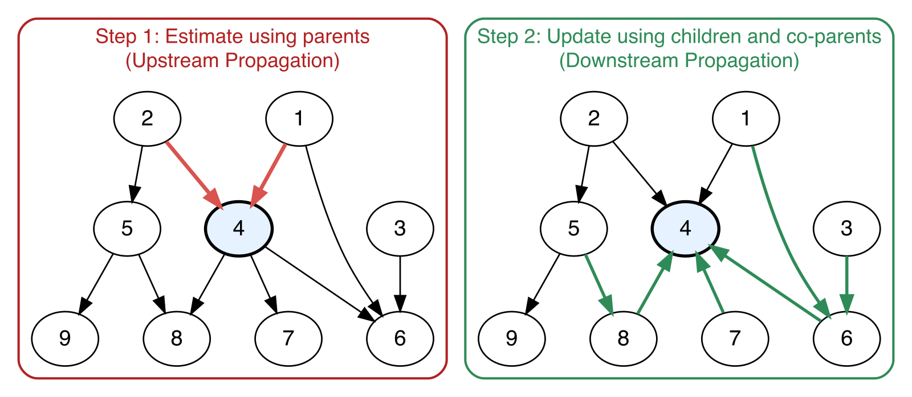
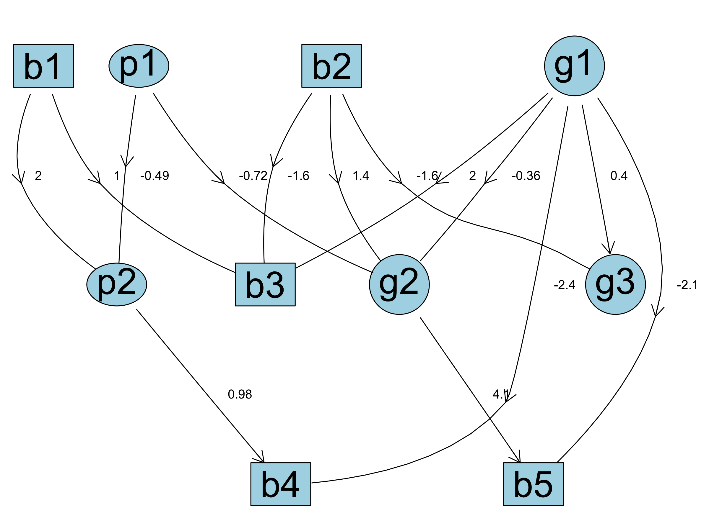

```{r, include = FALSE}
knitr::opts_chunk$set(
  collapse = TRUE,
  comment = "#>",
  eval = TRUE
)

source("/Users/mchampion/Documents/GitHub/abn_public/R/PredictABN.R")
```

This vignette provides an overview of how to perform inference with `ABN` across mixed-distribution DAGs.

## Background

In Bayesian Networks (BN), inference refers to the process of computing the posterior probability distribution of a variable given observed or known values of other variables in the network.
This is achieved using exact methods such as variable elimination, belief propagation, and the junction tree algorithm, or approximate techniques such as Monte Carlo sampling and likelihood weighting [@Darwiche_2009].
These methods rely on the assumption that conditional dependencies are explicitly defined and that the joint probability distribution can be factorized accordingly [@Pearl_1988].

However, performing exact probabilistic inference in Additive Bayesian Networks (ABN) is challenging. While traditional BNs focus heavily on direct probabilistic reasoning, ABNs model conditional dependencies through Generalized Linear Models (GLMs). Consequently, exact numerical integration across mixed continuous and discrete distributions (Gaussian, Poisson, Binomial, and Multinomial) quickly becomes computationally expensive.


To address these challenges, we propose a two-step inference procedure, as described in Figure  \@ref(fig:workflow):

1. Upstream estimation: The node to infer is estimated conditionally given its parents.

2. Downstream refinement: This estimate is updated by incorporating information from both its children and its co-parents (the Markov blanket).

```{r workflow, echo=FALSE, fig.cap="Workflow of the two-step inference procedure.",eval=TRUE,out.width="80%"}

```

When the full Markov blanket is not observed, the procedure generalizes to global network propagation. This involves topologically ordering the graph nodes, iteratively estimating each node's distribution based on its parents, and subsequently updating the distributions in reverse order by incorporating information from its children and co-parents. 

Some useful definitions:

- **Hypothesis**: The variable(s) whose value or probability distribution we want to infer.

- **Evidence**: The set of known or observed values of other variables in the network. 

- **Markov blanket**: The set of variables consisting of a node's parents, its children, and its children's parents (co-parents). A node is conditionnally independent of all other nodes in the network given its Markov blanket.


## Inference when the Markov blanket is known

In this section, we focus on the scenario where we have complete information about the Markov blanket of the node we want to infer. The Markov blanket captures all the relevant dependencies necessary to perform inference for that node. When the Markov blanket is fully observed, the inference process becomes more straightforward, as the target node is conditionally independent of all other nodes in the network given this surrounding set.

Consider the following graph topology:

- $X$ is the target node to infer (the hypothesis),

- $\mathscr{A}=\{A1,A2\}$ is the set of parents of $X$,

- $\mathscr{B}=\{B1,B2,B3,B4\}$ is the set of children of $X$,

- $\mathscr{C}=\{C1,C2\}$ is the set of parents of the children of $X$ (co-parents of $X$),

- directed edges may also exist between $\mathscr{A}$ and $\mathscr{B}$, as well as between $\mathscr{A}$ and $\mathscr{C}$.

```{r diagram, echo=FALSE, eval=TRUE, fig.keep='all', warning = FALSE, message = FALSE}
library(igraph)

# Define edge list
edges <- c(
  "A1", "X",
  "A2", "X",
  "X", "B1",
  "X", "B2",
  "X", "B3",
  "X", "B4",
  "C1", "B1",
  "C1", "B2",
  "C2", "B2",
  "C2", "B3",
  "C2", "B4",
  "A2", "C2",
  "A1", "B1"
)

# Create graph object
g <- graph(edges, directed = TRUE)

# Set line styles: dashed (lty=2) for A2->C2 and A1->B1, solid (lty=1) for others
E(g)$lty <- 1
E(g)$lty[get.edge.ids(g, c("A2", "C2", "A1", "B1"))] <- 2

# Set node coordinates to mirror the hierarchical DOT layout
layout_coords <- matrix(c(
  -1.2,  2.0, # A1
   0.0,  0.0, # A2
  1.2,  2.0, # C1
   -3.0, -2.0, # X
   -1.0, -2.0, # C2
  1.0, -2.0, # B1
   3.0, -2.0,  # B2
   -2.5,  0.0, # B3
    2.5,  0.0  # B4
), ncol = 2, byrow = TRUE)

par(mar = c(0.5, 0.5, 0.5, 0.5))
plot(
  g,
  layout = layout_coords,
  rescale = FALSE,
  xlim = c(-3.5, 3.5),
  ylim = c(-2.5, 2.5),
  vertex.shape = "circle",
  vertex.size = 75,
  vertex.color = "white",
  vertex.frame.color = "black",
  vertex.label.color = "black",
  vertex.label.cex = 0.9,
  edge.arrow.size = 0.4,
  edge.color = "black",
  edge.lty = E(g)$lty
)
```


The set of nodes $\mathscr{A} \cup \mathscr{B} \cup \mathscr{C}$ constitutes the Markov blanket of $X$, containing all necessary information to infer the distribution of $X$.

The inference procedure follows two steps:

- Step 1: Estimate the initial distribution of $X$ given its parents $\mathscr{A}$,

- Step 2: Update this estimate by incorporating observed information from its children $\mathscr{B}$ and their co-parents $\mathscr{C}$.


### Step 1: estimation using the parents 

The first step of the procedure computes the prior conditional distribution of $X$ given its parents, i.e. $\mathbb{P}(X \mid \mathscr{A})$.

The calculation depends on the parametric famility of $X$: 

- Gaussian distribution: 

    - Mean:
$\mathbb{E}(X \mid \mathscr{A}) = \beta_{0} + \beta_{1} A1 +  \beta_{2} A2.$ 

    - Variance: $var(X \mid \mathscr{A}) = \frac{1}{\tau},$ where $\tau$ is the node's precision estimated during model fitting.

*Remark: In practice, if the precision parameter $\tau$ is explicitly estimated during model fitting, the variance is computed as $var(X \mid \mathscr{A})= 1 / \tau$. Otherwise, if precision estimation is unavailable or omitted, the variance falls back to the empirical variance of the observed data for that node.*

- Poisson distribution:
$\mathbb{E}(X \mid \mathscr{A}) = \exp \left( \beta_{0} + \beta_{1} A1 +  \beta_{2} A2 \right).$ 

- Binomial distribution:

    - Sucess probability:
$\mathbb{P}(X=1 \mid \mathscr{A}) = \frac{1}{1+\exp \left( - (\beta_{0} + \beta_{1} A1 +  \beta_{2} A2)\right)}$.

    - Complementary probability:
    $\mathbb{P}(X=0 \mid \mathscr{A})=1-\mathbb{P}(X=1 \mid \mathscr{A}).$ 

- Multinomial distribution ($K$ categories):

    - Category probability ($\ell \in \{1, \dots, K-1\}$):
$\mathbb{P}(X=\ell\mid \mathscr{A}) = \frac{\exp \left( \beta_{0,\ell} + \beta_{1,\ell} A1 + \beta_{2,\ell} A2 \right)}{1+ \sum_{j=1}^{K-1} \exp \left( \beta_{0,j} + \beta_{1,j} A1 + \beta_{2,j} A2\right)}$.

    - Reference category probability ($K$):
    $\mathbb{P}(X=K\mid\mathscr{A})=\frac{1}{1+ \sum_{j=1}^{K-1} \exp \left( \beta_{0,j} + \beta_{1,j} A1 + \beta_{2,j} A2\right)}.$ 


To calculate these quantities, substitute the observed or estimated values of the parent nodes $\mathscr{A}$ directly into the linear predictor formula.


### Step 2: estimate's update using children and co-parents

At the end of Step 1, we have an initial estimate of the distribution of $X$ given its parents, $\mathbb{P}(X\mid \mathscr{A})$. In this second step, we refine this estimate by incorporating information from its children $\mathscr{B}$ and their co-parents $\mathscr{C}$, yielding the updated conditional distribution $\mathbb{P}(X|\mathscr{A},\mathscr{B},\mathscr{C})$.

First, consider the case where $X$ has a single child $B\in\mathscr{B}$. Depending on the parametric family of $X$:

- Binomial or Multinomial: Bayes' theorem gives the updated categorical distribution: 
$$ \mathbb{P}(X \mid \mathscr{A}, B, \mathscr{C}) = \frac{\mathbb{P}(B \mid X, \mathscr{C}) \mathbb{P}(X\mid \mathscr{A})}{\mathbb{P}(B \mid \mathscr{A},\mathscr{C})}= \frac{\mathbb{P}(B \mid X, \mathscr{C}) \mathbb{P}(X\mid \mathscr{A})}{\sum_X \mathbb{P}(B \mid X, \mathscr{C}) \mathbb{P}(X \mid \mathscr{A})}.$$ 

- Poisson: the updated conditional expectation $\mathbb{E}(X \mid \mathscr{A}, B, \mathscr{C})$ is given by: 
$$\mathbb{E}(X \mid \mathscr{A}, B, \mathscr{C}) = \sum_{X=0}^{\infty} X \mathbb{P}(X \mid \mathscr{A}, B, \mathscr{C}) = \frac{\sum_{X=0}^{\infty} X \mathbb{P}(B\mid X, \mathscr{C}) \mathbb{P}(X \mid \mathscr{A}) }{\sum_{X=0}^{\infty} \mathbb{P}(B\mid X, \mathscr{C}) \mathbb{P}(X \mid \mathscr{A})}.$$ 
- Gaussian:

    - expectation: 
$$\mathbb{E}(X \mid \mathscr{A}, B, \mathscr{C}) = \int X \mathbb{P}(X \mid \mathscr{A}, B, \mathscr{C}) dX = \frac{\int X \mathbb{P}(B \mid X, \mathscr{C}) \mathbb{P}(X \mid \mathscr{A}) dX}{\int \mathbb{P}(B \mid X, \mathscr{C}) \mathbb{P}(X \mid \mathscr{A}) dX}.$$ 

    - variance:
$$var(X \mid \mathscr{A}, B, \mathscr{C}) = \mathbb{E}(X^2 \mid \mathscr{A}, B, \mathscr{C}) - \left(\mathbb{E}(X \mid \mathscr{A}, B, \mathscr{C})^2\right),$$
where: 
$$\mathbb{E}(X^2 \mid \mathscr{A}, B, \mathscr{C}) =  \frac{\int X^2 \mathbb{P}(B\mid X, \mathscr{C}) \mathbb{P}(X \mid \mathscr{A}) dX}{\int \mathbb{P}(B\mid X, \mathscr{C}) \mathbb{P}(X \mid \mathscr{A}) dX}.$$ 


In these expressions, the conditional distribution $\mathbb{P}(X\mid \mathscr{A})$ computed in Step 1 is used as the prior:

- Binomial: $X \sim B(p_X)$, where $p_X$ is estimated in Step 1. 

- Gaussian: $X \sim N(\mu_X,\sigma_X^2)$, where $\mu_X$ and $\sigma_X^2$ are estimated in Step 1. 

- Poisson: $X \sim P(\lambda_X)$, where $\lambda_X$ is estimated in Step 1. 

- Multinomial: $X \sim Cat(p_{X,1},...,p_{X,K})$, where $p_{X,1},...,p_{X,K}$ are estimated in Step 1.

The conditional probability $\mathbb{P}(B \mid X, \mathscr{C})$ is derived from the regression model of child $B$:

- Binomial child: $B \sim B(p_B)$, with $p_B = \frac{1}{1+\exp \left( - (\beta_{B0} + \beta_{B1} X + \beta_{B2} C)\right)},$ 

- Gaussian child: $B \sim N(\mu_B,\sigma_B^2)$, with $\mu_B = \beta_{B0} + \beta_{B1} X+ \beta_{B2} C$ and variance $\sigma_B = \frac{1}{\tau_B},$
where $\tau_B$ is the precision parameter extracted directly from the ABN model fit.

- Poisson child: $B \sim P(\lambda_B)$, with $\lambda_B = \exp \left( \beta_{B0} + \beta_{B1} X + \beta_{B2} C \right)$.

Here, for simplicity, $C \in \mathscr{C}$ represents the co-parent of child $B$, aside from $X$. Known or observed values of $C$ are directly substituted into the linear predictor.

When $X$ has multiple children ($\# \mathscr{B}>1$), the estimation procedure is repeated for each child $B_j \in\mathscr{B}$, and the resulting estimates are averaged across all children:

- Poisson:
$\mathbb{E}(X\mid \mathscr{A},\mathscr{B},\mathscr{C}) = \frac{1}{\# \mathscr{B}} \sum_{B_j \in\mathscr{B}}  \mathbb{E}(X \mid \mathscr{A},B_j,\mathscr{C}_j),$

- Gaussian:

    - expectation: $\mathbb{E}(X \mid \mathscr{A},\mathscr{B},\mathscr{C})$ is given by:
$\mathbb{E}(X \mid \mathscr{A},\mathscr{B},\mathscr{C}) = \frac{1}{\# \mathscr{B}} \sum_{B_j \in\mathscr{B}}  \mathbb{E}(X\mid \mathscr{A},B_j,\mathscr{C}_j),$

    - variance:  $var(X \mid \mathscr{A},\mathscr{B},\mathscr{C})$ is given by:
    $var(X\mid \mathscr{A},\mathscr{B},\mathscr{C}) = \frac{1}{\# \mathscr{B}^2} \sum_{B_j \in\mathscr{B}}  var(X\mid \mathscr{A},B_j,\mathscr{C}_j),$
    
- Binomial:

    - success probability: $\mathbb{P}(X=1 \mid \mathscr{A},\mathscr{B},\mathscr{C}) = \frac{1}{\# \mathscr{B}} \sum_{B_j \in\mathscr{B}}  \mathbb{P}(X=1\mid \mathscr{A},B_j,\mathscr{C}_j),$
    
    - complementary probability: $\mathbb{P}(X=0 \mid \mathscr{A},\mathscr{B},\mathscr{C}) = 1-\mathbb{P}(X=1\mid \mathscr{A},\mathscr{B},\mathscr{C}),$

where $\mathscr{C}_j$ denotes the set of co-parents corresponding to child $B_j$. 


## Inference with partial information

In this section, we tackle the more general case, where the full Markov blanket of a target node is not completely observed. To estimate the conditional distribution of such a node, we go through the graph iteratively. We first compute initial estimates using upstream information (from parents), and subsequently refine these estimates by incorporating downstream information (from children and co-parents), applying the two-step procedure described in Section 2. By propagating information across the DAG, we progressively refine the target node's estimated distribution given the available partial evidence.

The general inference procedure follows three main steps:

1. Topological sorting: We first determine a topological ordering of the DAG nodes, ensuring that each node appears after all of its parents and before all of its children.


2. Upstream propagation: Following the topological order from roots to leaves, we iteratively estimate the distribution of each node given its parents (applying the logic from Step 1):

- Root nodes (no parents): distributions are estimated directly from empirical data:

  - Gaussian: sample mean $\widehat{\mu}$ and variance $\widehat{\sigma}^2$ (derived from precision $\tau$ or empirical variance),
  
  - Poisson: sample mean $\widehat{\lambda}$, 
  
  - Binomial/Multinomial: sample class frequencies/proportions.

- Child nodes: distributions are computed using the current estimated distributions of their parents. If a parent node is observed (acts as an evidence), its fixed value is used directly. Otherwise:

  - Gaussian parent $A$: we substitute its estimated conditional expectation $\mathbb{E}(A)$, 

  - Poisson parent $A$: we substitute its estimated conditional expectation $\mathbb{E}(A)$,

  - Binomial parent $A$: we marginalize over its binary state space ($A\in \{0,1\}$),
  
  - Multinomial parent $A$: we marginalize over all $K$ categories ($A\in \{1,...,K\}$).

3. Downstream propagation: Going through the network in reverse topological order (from leaves to roots), we iteratively update each node's distribution using information from its children and co-parents (applying the logic from Step 2) until reaching the target node of interest:

- Leaves nodes (no children): distributions remain unchanged:

- Parents nodes: Distributions are updated using the estimated distributions of their children and co-parents. If a co-parent node $C$ is observed, its known value is used directly. Otherwise:

  - Gaussian co-parent $C$: we substitute its estimated expectation $\mathbb{E}(C)$,

  - Poisson co-parent $C$: we substitute its estimated expectation $\mathbb{E}(C)$,

  - Binomial co-parent $C$: we marginalize over its binary outcomes,
  
  - Multinomial co-parent $C$:  we marginalize over all $K$ categories.


## Example

To illustrate the inference procedure in practice, we consider an illustrative example from the `abn` package. The dataset `ex1.dag.data` contains 10 variables, including a mix of continuous (Gaussian), binary (Binomial), and count (Poisson) nodes, with 10,000 observations generated from a known DAG structure.

```{r, message=FALSE, warning = FALSE}
library(abn)

# Load an illustrative example
mydat <- ex1.dag.data
str(mydat)
```

First, we define the parametric distribution family for each variable, then learn the network structure and estimate its parameters using `abn`.

```{r, message=FALSE, warning=FALSE}
# Specify the distributions of the nodes
mydists <- list(b1="binomial", 
                p1="poisson",
                g1="gaussian", 
                b2="binomial", 
                p2="poisson",
                b3="binomial", 
                g2="gaussian", 
                b4="binomial", 
                b5="binomial", 
                g3="gaussian") 

# Run abn
max.par <- 4 # set the same max parents for all nodes
mycache <- buildScoreCache(data.df = mydat, 
                           data.dists = mydists,
                           method = "bayes",max.parents = max.par) 
mp.dag <- mostProbable(score.cache = mycache)
myfit <- fitAbn(object = mp.dag)
```

```{r, echo=FALSE,eval=TRUE,out.width="80%"}

```


Our goal is to infer the target variable $g2$, by computing its posterior conditional distribution given observed evidence. 

As a first scenario, suppose the full Markov blanket of $g2$ is known: its parents $p1=3$, $b2=\text{"y"}$, $g1=2$, and its child $b5=\text{"y"}$.
We first compute the conditional expected mean $\mathbb{E}(g2 \mid p1=3, b2=\text{"y"}, g1=2)$ and variance using only its parent set.


```{r, message=FALSE}
library(igraph)

hypothesis <- "g2"
evidence <- list("p1"=3, "b2"=factor("y",levels = c("n","y")),"g1"=2)
graph <- graph_from_adjacency_matrix(t(mp.dag$dag))

# Estimate E(g2|p1=3, b2=y, g1=2)
prediction <- predict_node_from_parent(data = mydat, dists = mydists, graph, 
                        fit = myfit$modes, node = "g2", evidence = evidence)
```

```{r print-prediction, echo=FALSE}
cat(sprintf("Estimated E(g2 | p1=3, b2='y', g1=2)  = %.2f\n", prediction[1]))
cat(sprintf("Estimated var(g2 | p1=3, b2='y', g1=2) = %.2f\n", prediction[2]))
```

Next, we incorporate downstream information from its child $b5 = \text{"y"}$ to obtain the fully updated Markov blanket conditional expectation $\mathbb{E}(g2 \mid p1 = 3, b2=\text{"y"}, g1=2, b5=\text{"y"})$.

```{r}
evidence <- list("p1"=3, "b2"=factor("y",levels = c("n","y")),"g1"=2, 
                 "b5"=factor("y",levels = c("n","y")))

# Update the estimated value using the children
prediction_updated <- predict_node_from_children(data = mydat, dists = mydists, graph, 
                            fit = myfit$modes, node = "g2", evidence, 
                            predictions = c(evidence,list("g2"=prediction)))
```

```{r, echo=FALSE}
cat(sprintf("Updated E(g2 | p1=3, b2='y', g1=2, b5 = 'y')  = %.2f\n", prediction_updated[1]))
cat(sprintf("Updated var(g2 | p1=3, b2='y', g1=2, b5 = 'y') = %.2f\n", prediction_updated[2]))
```

This manual step-by-step update matches the exact output returned when calling the complete `predictABN()` workflow across the network:

```{r}
predictions <- predictABN(data = mydat, dists = mydists, dag = mp.dag$dag, 
                  fit = myfit$modes, hypothesis = "g2", evidence = evidence)
```

```{r, echo=FALSE}
cat(sprintf("Estimated E(g2|b2='y',p1=3,g1=2,b5='y') = %.2f\n",round(predictions$prediction_hypothesis[1],2)))
cat(sprintf("Estimated var(g2|b2='y',p1=3,g1=2,b5='y') = %.2f\n",round(predictions$prediction_hypothesis[2],2)))
```

In practice, we rarely observe the complete Markov blanket. Suppose now that we only observe partial evidence from nodes $b2 = \text{"y"}$ and $b5 = \text{"y"}$. To compute $\mathbb{E}(g2 \mid b2=\text{"y"}, b5=\text{"y"})$, `predictABN()` first determines the topological ordering of the network to guide forward and backward message passing:
 
```{r}
node_order <- names(topo_sort(graph, mode="out"))
node_order
```

The algorithm goes through the network from root node $b1$ down to $b5$ (forward propagation, marginalizing unobserved parents) and propagates likelihood information back to $g2$ (backward propagation):

```{r}
predictions <- predictABN(data = mydat, dists = mydists, dag = mp.dag$dag, 
                          fit = myfit$modes, hypothesis = "g2", 
                          evidence = list("b2"="y",b5="y"))
```

```{r, echo=FALSE}
cat(sprintf("Estimated E(g2 | b2='y', b5='y')  = %.2f\n", predictions$prediction_hypothesis[1]))
cat(sprintf("Estimated var(g2 | b2='y', b5='y') = %.2f\n", predictions$prediction_hypothesis[2]))
```
