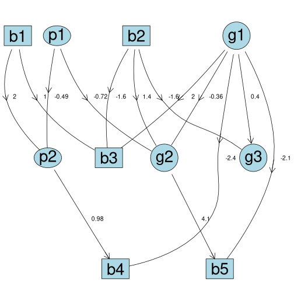
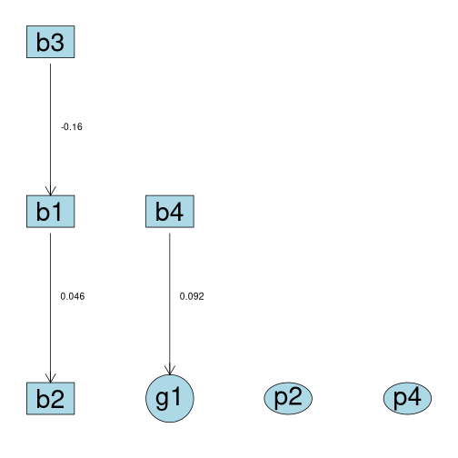

``` r
library(abn)
#> abn version 3.1.9 (2025-06-26) is loaded.
#> To cite the package 'abn' in publications call: citation('abn').
#> 
#> Attaching package: 'abn'
#> The following object is masked from 'package:base':
#> 
#>     factorial
```

In this vignette, we will simulate data from an additive Bayesian network and compare it to the original data.

# Fit a model to the original data

First, we will fit a model to the original data that we will use to simulate new data from.
We will use the `ex1.dag.data` data set and fit a model to it.


``` r
# Load example data
mydat <- ex1.dag.data

# Set the distribution of each node
mydists <- list(b1="binomial",
                p1="poisson",
                g1="gaussian",
                b2="binomial",
                p2="poisson",
                b3="binomial",
                g2="gaussian",
                b4="binomial",
                b5="binomial",
                g3="gaussian")

# Build the score cache
mycache <- buildScoreCache(data.df = mydat,
                           data.dists = mydists,
                           method = "bayes",
                           max.parents = 4)
#> Warning: package 'INLA' was built under R version 4.5.0
#> Loading required package: Matrix
#> This is INLA_25.06.07 built 2025-06-11 18:54:45 UTC.
#>  - See www.r-inla.org/contact-us for how to get help.
#>  - List available models/likelihoods/etc with inla.list.models()
#>  - Use inla.doc(<NAME>) to access documentation

# Structure learning
mp.dag <- mostProbable(score.cache = mycache)
#> Step1. completed max alpha_i(S) for all i and S
#> Total sets g(S) to be evaluated over: 1024

# Estimate the parameters
myfit <- fitAbn(object = mp.dag)

# Plot the DAG
plot(myfit)
```



# Simulate new data

Based on the `abnFit` object, we can simulate new data.
By default `simulateAbn()` synthesizes 1000 new data points.


``` r
mydat_sim <- simulateAbn(object = myfit)
str(mydat_sim)
#> 'data.frame':	1000 obs. of  10 variables:
#>  $ b1: Factor w/ 2 levels "0","1": 2 2 2 2 2 2 2 2 2 2 ...
#>  $ b2: Factor w/ 2 levels "0","1": 1 1 1 1 2 1 1 2 2 2 ...
#>  $ b3: Factor w/ 2 levels "0","1": 2 1 2 1 1 1 2 1 2 2 ...
#>  $ b4: Factor w/ 2 levels "0","1": 2 2 2 2 2 2 2 2 2 2 ...
#>  $ b5: Factor w/ 2 levels "0","1": 2 2 2 2 2 2 1 2 2 2 ...
#>  $ g1: num  0.796 -0.92 0.167 -2.602 -0.432 ...
#>  $ g2: num  0.112 -0.708 -1.621 0.115 1.504 ...
#>  $ g3: num  0.703 -0.891 0.206 -0.55 -1.458 ...
#>  $ p1: num  0 1 1 0 0 0 1 0 1 0 ...
#>  $ p2: num  17 7 6 16 9 12 7 9 5 9 ...
```

In the background, the `simulateAbn()` function translates the `abnFit` object into a BUGS model and calls the `rjags` package to simulate new data.

Especially for debugging purposes, it can be usefull to manually inspect the BUGS file that is generated by `simulateAbn()`.
This can be done by not running the simulation with `run.simulation = FALSE` and print the BUGS file to console with `verbose = TRUE`.


``` r
# Simulate new data and print the BUGS file to the console
simulateAbn(object = myfit,
            run.simulation = FALSE,
            verbose = TRUE)
```

To store the BUGS file for reproducibility or manual inspection, we can set the `bugsfile` argument to a file name to save the BUGS file to disk.

# Compare the original and simulated data

We can compare the original and simulated data by plotting the distributions of the variables.


``` r
# order the columns of mydat equal to mydat_sim
mydat <- mydat[, colnames(mydat_sim)]
```


``` r
library(ggplot2)
library(gridExtra)

# Create a list of variables
variables <- names(mydat)

# Initialize an empty list to store plots
plots <- list()

# For each variable
for (i in seq_along(variables)) {
  # Check if the variable is numeric
  if (is.numeric(mydat[[variables[i]]])) {
    # Create a histogram for the variable in mydat
    p1 <- ggplot(mydat, aes(!!as.name(variables[i]))) +
      geom_histogram(binwidth = 0.5, fill = "skyblue", color = "black") +
      labs(title = paste("mydat", variables[i]), x = variables[i], y = "Count") +
      theme_minimal()

    # Create a histogram for the variable in mydat_sim
    p2 <- ggplot(mydat_sim, aes(!!as.name(variables[i]))) +
      geom_histogram(binwidth = 0.5, fill = "skyblue", color = "black") +
      labs(title = paste("mydat_sim", variables[i]), x = variables[i], y = "Count") +
      theme_minimal()
  } else {
    # Create a bar plot for the variable in mydat
    p1 <- ggplot(mydat, aes(!!as.name(variables[i]))) +
      geom_bar(fill = "skyblue", color = "black") +
      labs(title = paste("mydat", variables[i]), x = variables[i], y = "Count") +
      theme_minimal()

    # Create a bar plot for the variable in mydat_sim
    p2 <- ggplot(mydat_sim, aes(!!as.name(variables[i]))) +
      geom_bar(fill = "skyblue", color = "black") +
      labs(title = paste("mydat_sim", variables[i]), x = variables[i], y = "Count") +
      theme_minimal()
  }

  # Combine the plots into a grid
  plots[[i]] <- arrangeGrob(p1, p2, ncol = 2)
}
```


``` r
# Print all plots
do.call(grid.arrange, c(plots, ncol = 1))
```



The plots show that the distributions of the original and simulated data are similar.

