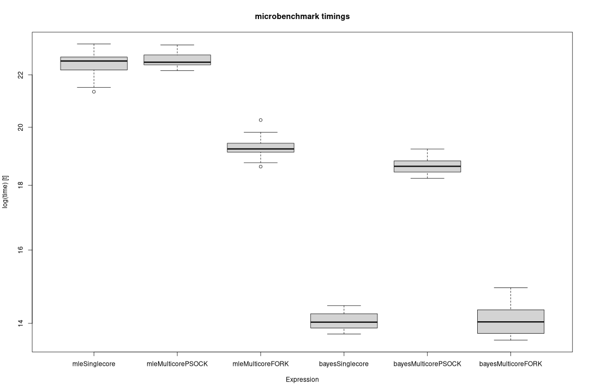

This vignette provides an overview of parallel computation in R with the `parallel` package, focusing on its implementation in the `abn` package.
We will also discuss the difference between the concepts of the "FORK" and "PSOCK" parallelisation methods.

# Introduction

The `abn` package allows for efficient modelling of additive Bayesian networks.
Certain steps in its workflow, such as computing the score cache, are well-suited for parallel execution.
The score cache stores the scores of all possible parent sets for each node in the network.
By running computations for multiple combinations simultaneously across different cores, we can significantly speed up this process.
The `abn` package uses the parallel package to achieve this.

## FORK vs. PSOCK

The `parallel` package in R offers two main types of parallelisation:

- *FORK*: Predominantly used on Unix-based systems (including Linux and Mac OS), with FORK a parent process creates child processes that are a copy of the parent process.
The key advantage of FORK is that it shares memory objects between the processes, which can lead to significant efficiencies when dealing with large objects.

- *PSOCK*: Used on all systems, including Windows, PSOCK creates a set of independent R processes and communicates between them using sockets.
Each PSOCK worker is a separate R process, and there is no memory sharing between workers resulting in a higher memory overhead compared to FORK.

The choice between FORK and PSOCK depends on the operating system and the specific use case.

# Parallelisation in the `abn` package

To illustrate the difference between FORK and PSOCK, we will compare their performance under both Bayesian and frequentist approaches.
We will use the `microbenchmark` package to measure the time it takes to compute the score cache for a given data set and parameters.

## Load the data and specify the parameters


``` r
library(abn)

set.seed(123456)
```


``` r
# Prepare data and parameters
df <- FCV[, -c(13)]
mydists <- list(FCV = "binomial",
                FHV_1 = "binomial",
                C_felis = "binomial",
                M_felis = "binomial",
                B_bronchiseptica = "binomial",
                FeLV = "binomial",
                FIV = "binomial",
                Gingivostomatitis = "binomial",
                URTD = "binomial",
                Vaccinated = "binomial",
                Pedigree="binomial",
                Outdoor="binomial",
                GroupSize="poisson",
                Age="gaussian")
maxparents <- 5
ncores <- 2
```

## Benchmarking

We compare the following methods:

- `mleSinglecore`: Maximum likelihood estimation with single core
- `mleMulticorePSOCK`: Maximum likelihood estimation on 2 cores using PSOCK
- `mleMulticoreFORK`: Maximum likelihood estimation on 2 cores using FORK
- `bayesSinglecore`: Bayesian estimation with single core
- `bayesMulticorePSOCK`: Bayesian estimation on 2 cores using PSOCK
- `bayesMulticoreFORK`: Bayesian estimation on 2 cores using FORK


``` r
res <- NULL
if (requireNamespace("microbenchmark", quietly = TRUE)) {
  # Benchmark
  res <- microbenchmark::microbenchmark(mleSinglecore = buildScoreCache(data.df = df,
                                                                        data.dists = mydists,
                                                                        method = "mle",
                                                                        max.parents = maxparents,
                                                                        control = build.control(method = "mle",
                                                                                                ncores = 1)),
                                        mleMulticorePSOCK = buildScoreCache(data.df = df,
                                                                            data.dists = mydists,
                                                                            method = "mle",
                                                                            max.parents = maxparents,
                                                                            control = build.control(method = "mle",
                                                                                                    ncores = ncores,
                                                                                                    cluster.type = "PSOCK")),
                                        mleMulticoreFORK = buildScoreCache(data.df = df,
                                                                           data.dists = mydists,
                                                                           method = "mle",
                                                                           max.parents = maxparents,
                                                                           control = build.control(method = "mle",
                                                                                                   ncores = ncores,
                                                                                                   cluster.type = "FORK")),
                                        bayesSinglecore = buildScoreCache(data.df = df,
                                                                          data.dists = mydists,
                                                                          method = "bayes",
                                                                          max.parents = maxparents,
                                                                          control = build.control(method = "bayes",
                                                                                                  ncores = 1)),
                                        bayesMulticorePSOCK = buildScoreCache(data.df = df,
                                                                              data.dists = mydists,
                                                                              method = "bayes",
                                                                              max.parents = maxparents,
                                                                              control = build.control(method = "bayes",
                                                                                                      ncores = ncores,
                                                                                                      cluster.type = "PSOCK")),
                                        bayesMulticoreFORK = buildScoreCache(data.df = df,
                                                                             data.dists = mydists,
                                                                             method = "bayes",
                                                                             max.parents = maxparents,
                                                                             control = build.control(method = "bayes",
                                                                                                     ncores = ncores,
                                                                                                     cluster.type = "FORK")),
                                        times = 25)
} else {
  message("The microbenchmark package is not available. Skipping benchmarking.")
}
```


``` r
if (!is.null(res)) {
  boxplot(res)
} else {
  message("No benchmarking results to plot.")
}
```



The boxplot illustrates the time distribution for computing the score cache using different methods.

We can see that the Bayesian approach is generally faster than the frequentist approach.
This is due to the efficient implementation of the score cache computation in the Bayesian approach.
It leverages either an internal C/C++ implementation or INLA, an efficient implementation of the Bayesian approach. The method selection, by default, is automatic and depends on the specific use case.
The frequentist approach on the other hand relies on other R packages, which introduces a higher overhead.

The FORK method is generally faster than the PSOCK method, especially for the Bayesian approach.
This is because the FORK method shares memory objects between the processes, leading to significant efficiencies with large objects.
In contrast, the PSOCK method creates a set of independent R processes and communicates between them using sockets, which introduces a higher memory overhead.
For this example, PSOCK shows worse performance than FORK, likely because the problem is not large enough to greatly benefit from parallelization.

In conclusion, while the Bayesian approach is generally faster than the frequentist approach, the speed up is larger in the frequentist approach.
However, the choice between FORK and PSOCK depends on the operating system and the specific use case.
