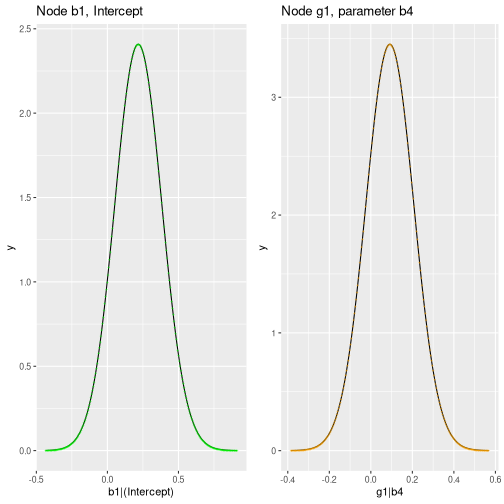

``` r
library(abn)
```

In this vignette, we will discuss the parameter learning in the context of additive Bayesian network modelling with the package `abn`.

# Background

In the context of additive Bayesian network (ABN) modelling, parameter learning refers to the process of estimating the parameters of the graphical model.
The parameters of the model are the coefficients of the linear regression models that are used to model the conditional probability distributions of the nodes in the network.
They are estimated using the data that is available for the nodes in the network.

# Fitting an ABN model

The `fitAbn()` function is used to estimate the parameters of an ABN model.
In principle, we need the data and a directed acyclic graph (DAG) that specifies the structure of the network.
These, together with additional arguments, are provided by an object of `abnLearned` to `fitAbn()` which will then estimate the parameters of the model.
This process is illustrated in the `vignette("01_quick_start_example")`.

Alternatively, with `fitAbn()` we can fit the parameters to a manually specified DAG.
In this case, we need to provide the data, its distributions and the DAG as arguments to `fitAbn()`:


``` r
# Load an illustrative subset of the example data
mydat <- ex0.dag.data[,c("b1","b2","b3","g1","b4","p2","p4")]

# Specify the distributions of the nodes
mydists <- list(b1="binomial",
                b2="binomial",
                b3="binomial",
                g1="gaussian",
                b4="binomial",
                p2="poisson",
                p4="poisson" )

# Define a DAG
mydag <- matrix(data=c( 0,0,1,0,0,0,0, # b1<-b3
                        1,0,0,0,0,0,0, # b2<-b1
                        0,0,0,0,0,0,0, #
                        0,0,0,0,1,0,0, # g1<-b4
                        0,0,0,0,0,0,0, #
                        0,0,0,0,0,0,0, #
                        0,0,0,0,0,0,0 #
), byrow=TRUE,ncol=7)
colnames(mydag) <- rownames(mydag) <- names(mydat)
```

Fit the model to calculate the log marginal likelihood goodness of fit:


``` r
myres.c <- fitAbn(dag = mydag,
                  data.df = mydat,
                  data.dists = mydists,
                  method = "bayes")
plot(myres.c)
```


# Examine the parameter estimates

We can examine the parameter estimates with the `print()` method for the class `abnFit`


``` r
print(myres.c)
#> The ABN model was fitted using a Bayesian approach. The estimated modes (the highest posterior density values of the parameters) are:
#> 
#> $b1
#> b1|(Intercept)          b1|b3 
#>          0.217         -0.164 
#> 
#> $b2
#> b2|(Intercept)          b2|b1 
#>         0.0286         0.0465 
#> 
#> $b3
#> b3|(Intercept) 
#>         0.0267 
#> 
#> $g1
#> g1|(Intercept)          g1|b4   g1|precision 
#>        -0.0494         0.0915         1.0054 
#> 
#> $b4
#> b4|(Intercept) 
#>           0.16 
#> 
#> $p2
#> p2|(Intercept) 
#>           2.34 
#> 
#> $p4
#> p4|(Intercept) 
#>           2.32 
#> 
#> Number of nodes in the network:  7
```

or by looking at the `coef` slot of the `abnFit` object returned by `fitAbn()`:

# Examine the marginal posterior densities

Furthermore, we can examine the marginal posterior densities of the parameters.
This is useful to assess the uncertainty in the parameter estimates and to check if the model is overfitting the data.

Now fit the model with `compute.fixed=TRUE` to calculate the marginal posterior distributions for all parameters:


``` r
myres.c2 <- fitAbn(dag = mydag,
                  data.df = mydat,
                  data.dists = mydists,
                  method = "bayes",
                  compute.fixed=TRUE)
```

The `marginals` slot of the `abnFit` object returned by `fitAbn()` contains a list of all marginal posterior densities.
We can plot some of the marginal posterior densities to assess the uncertainty in the parameter estimates:


``` r
library(ggplot2)
library(gridExtra)

df1 <- as.data.frame(myres.c2$marginals$b1[["b1|(Intercept)"]])
names(df1) <- c("x","y")
p1 <- ggplot(df1, aes(x=x, y=y)) +
  geom_line() +
  geom_point(shape = 43, color="green") +
  labs(x="b1|(Intercept)", title="Node b1, Intercept")

df2 <- as.data.frame(myres.c2$marginals$g1[["g1|b4"]])
names(df2) <- c("x","y")
p2 <- ggplot(df2, aes(x=x, y=y)) +
  geom_line() +
  geom_point(shape = 43, color="orange") +
  labs(x="g1|b4", title="Node g1, parameter b4")

grid.arrange(p1, p2, ncol=2)
```


Note that, by default, all variables are standardized (`centre = TRUE`).
